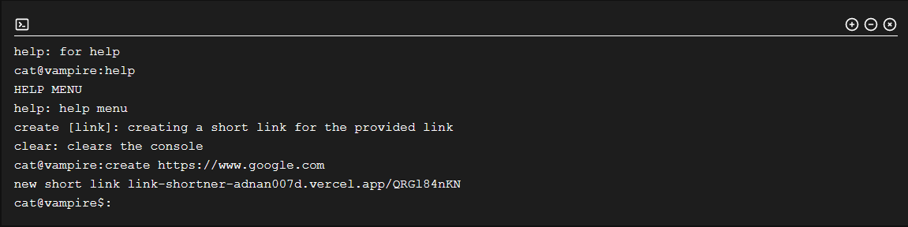

# Link Shortner

https://link-shortner-adnan007d.vercel.app/

Shorten your links the pro way :)

You get two types of interface

- Pro
- NooB

### Pro

There is a nice looking terminal where you can enter commands and create a new short link

### NooB

Good old basic GUI

### Made with Next.js using TypeScript :)
